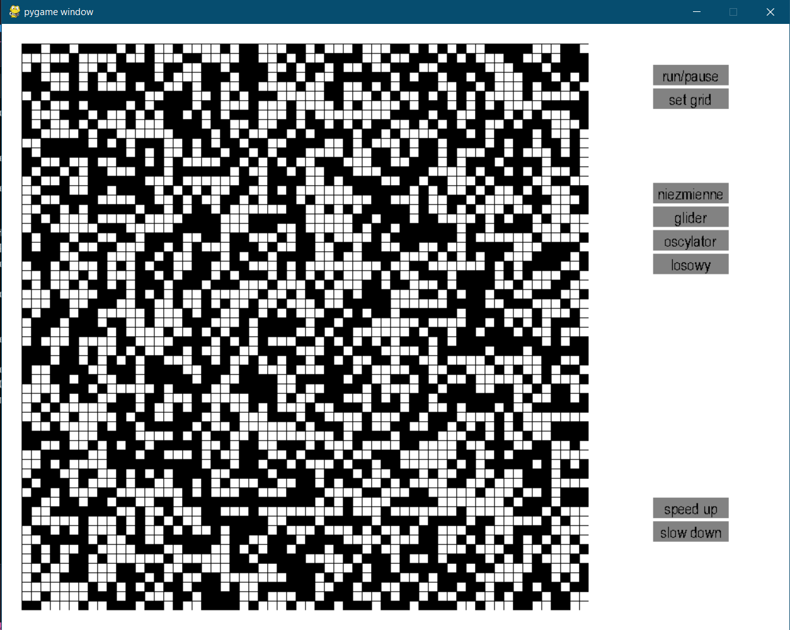
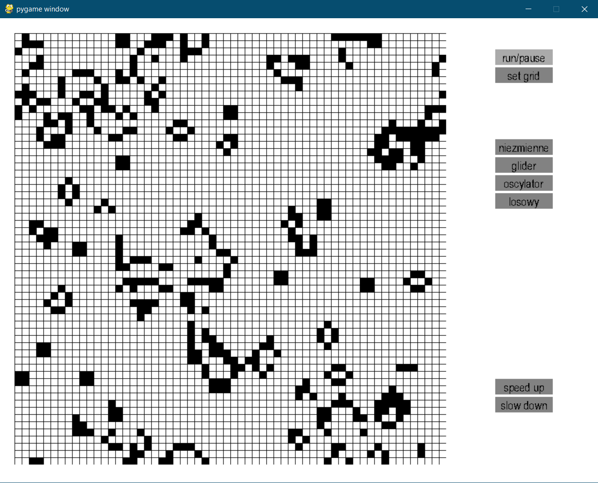

# Game of life-Cellular Automata 2D with Moore's neighborhood. Student's project.
<<<<<<< HEAD

Basic app of 2D cellular automata (Game of Life).
User can chose type of method to set cell to alive state such as:
- unchanging
- glider
- oscillator
- random
- clicking on chosen cell setting it to alive if dead or to dead if alive

run / pause simulation, speed up simulation or slow down simulation

App has been build using pygame library

=======
>>>>>>> origin/master
